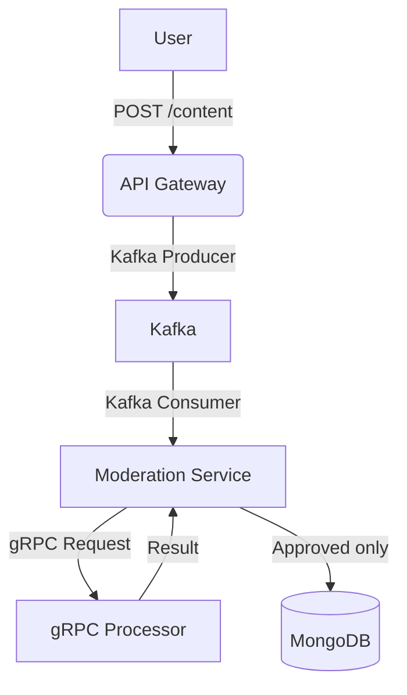

# Content Moderation App

## Project Presentation
The **Content Moderation App** is a microservices-based system that allows users to submit textual content for review. The system checks if the content is appropriate and either stores it in an approved list or rejects it. This mimics a real-world moderation process in social platforms.

## Technologies Used
- **Node.js** (Express, Apollo Server, gRPC)
- **MongoDB** (via MongoDB Compass)
- **Apache Kafka** (for asynchronous message passing)
- **gRPC** (for service-to-service communication)
- **GraphQL** (for API querying)
- **Postman** (for REST API testing)
- **GraphQL Playground** (for testing queries and mutations)
- **Docker** (only for Kafka/Zookeeper)

## Architecture Overview
The project is composed of the following services:

- **API Gateway** (`api-gateway`) - REST + GraphQL server
- **Moderation Service** (`moderation-service`) - Kafka consumer + MongoDB
- **gRPC Processor** (`grpc-processor`) - analyzes text content for approval
- **Kafka & Zookeeper** - asynchronous message broker

## Project Structure
```
microservices-app/
├── api-gateway/
│   ├── index.js
│   ├── kafkaClient.js
│   ├── db.js
│   └── graphql.js
├── moderation-service/
│   ├── consumer.js
│   └── db.js
├── grpc-processor/
│   └── server.js
├── shared/
│   └── moderation.proto
├── kafka/
│   └── docker-compose.yml
```

## Workflow

1. User submits content via REST (`POST /content`) or GraphQL mutation.
2. The API Gateway sends the content to Kafka (`content_submitted` topic).
3. The Moderation Service consumes the message from Kafka.
4. It calls the gRPC processor (`CheckContent` method).
5. If **approved**, it stores the content in MongoDB's `approvedContent` collection.
6. If **rejected**, nothing is saved.

## How to Test (Step by Step)

### 1. Submit Content via Postman
```
POST http://localhost:3000/content
Content-Type: application/json

{
  "text": "This is safe",
  "userId": "user123"
}
```

Expected Response:
```json
{ "message": "Content submitted for moderation" }
```

### 2. Submit via GraphQL Playground
```
mutation {
  submitContent(text: "This is bad", userId: "troll") {
    _id
    text
    approved
    createdAt
  }
}
```

Expected: Content saved to `pendingContent`, then sent to gRPC for check.

### 3. Query Approved Content
```
query {
  approvedContent {
    _id
    text
    userId
    createdAt
  }
}
```

### 4. gRPC Behavior
See `grpc-processor/server.js`, which defines:
```js
CheckContent: (call, callback) => {
  const result = call.request.text.toLowerCase().includes("bad") ? "rejected" : "approved";
  callback(null, { result });
}
```

## Testing Notes
- Run Kafka with Docker using `docker-compose up -d` inside `/kafka`.
- Run each service manually using `node` for easy debugging.
- Ensure MongoDB Compass is connected on port `27017`.
- Modify `consumer.js` to print results.

## Diagram


---


**Hedy Fathallah – Projet académique (Microservices & Architecture SOA)**  

=======
>>>>>>> 8409f57 (📝 Added complete README file)
